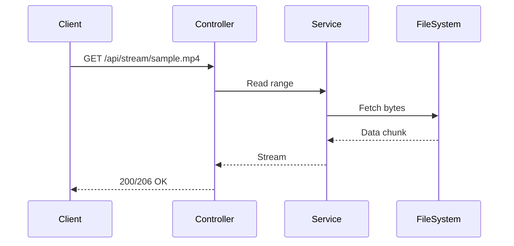

# StreamBridge – Local CDN Video Streaming Backend (POC)

A small-scale backend simulating CDN video delivery. Demonstrates streaming, caching, rate-limiting, and metrics.

## Quick Start

```bash
./mvnw spring-boot:run
```

Place `sample.mp4` in `/media`.

## Endpoints

* `/api/stream/{filename}` → stream file
* `/api/metrics` → metrics JSON
* `/actuator/health` → health check

## Example Commands

```bash
curl -v http://localhost:8080/api/stream/sample.mp4 -o /dev/null
curl -v -H "Range: bytes=0-1023" http://localhost:8080/api/stream/sample.mp4 -o /dev/null
curl -s http://localhost:8080/api/metrics | jq
```

## Architecture



## Why it exists
“Built as a short proof of concept to explore CDN and streaming systems after reading a backend developer role description.”

## Future ideas
Redis caching, multi-node setup, load testing.

## License
MIT

---

> StreamBridge was built as a small proof of concept to understand CDN-style backend systems — how they handle streaming, caching, and rate-limiting in real time.
