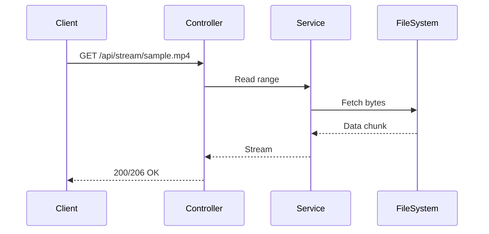

# StreamBridge – Local CDN Video Streaming Backend (POC)

A small-scale backend simulating CDN video delivery. Demonstrates streaming, caching, rate-limiting, and metrics.

## Quick Start

**Option 1: Using Maven Wrapper (recommended)**
```bash
./mvnw spring-boot:run          # Unix/macOS
mvnw.cmd spring-boot:run        # Windows
```

**Option 2: Using Maven (if installed)**
```bash
mvn spring-boot:run
```

**Option 3: Using VS Code Task**
- Open Command Palette (`Ctrl+Shift+P`)
- Run task: "Run StreamBridge"

Place `sample.mp4` in `/media` folder for testing.

## 🎥 Demo

Below is a short clip showing **StreamBridge** running locally:

<video src="docs/demo.mp4" width="640" controls></video>

This demo shows the backend streaming a local video file through the `/api/stream` endpoint, 
and the `/api/metrics` endpoint returning real-time system statistics.  
It demonstrates how CDN-style backends handle content delivery and track performance — all running locally.

## Endpoints

* `/api/stream/{filename}` → stream file
* `/api/metrics` → metrics JSON
* `/actuator/health` → health check

## Example Commands

```bash
curl -v http://localhost:8080/api/stream/sample.mp4 -o /dev/null
curl -v -H "Range: bytes=0-1023" http://localhost:8080/api/stream/sample.mp4 -o /dev/null
curl -s http://localhost:8080/api/metrics | jq
```

## Architecture



## Why it exists
“Built as a short proof of concept to explore CDN and streaming systems after reading a backend developer role description.”

## Development

**Prerequisites:**
- Java 17+ 
- No Maven installation required (uses Maven Wrapper)

**Build and Test:**
```bash
./mvnw clean compile    # Compile the project
./mvnw test            # Run tests
./mvnw clean package   # Build JAR file
```

**Project Structure:**
```
src/
├── main/java/com/abenezer/streambridge/
│   ├── controller/     # REST endpoints
│   ├── service/        # Business logic
│   ├── config/         # Configuration & filters
│   ├── metrics/        # Metrics collection
│   └── util/           # Utility classes
├── main/resources/
│   ├── application.yml # Configuration
│   └── static/         # Demo web page
└── test/               # Unit tests
```

## Future Ideas
Redis caching, multi-node setup, load testing, Docker containerization.

## License
MIT

---

> StreamBridge was built as a small proof of concept to understand CDN-style backend systems — how they handle streaming, caching, and rate-limiting in real time.
